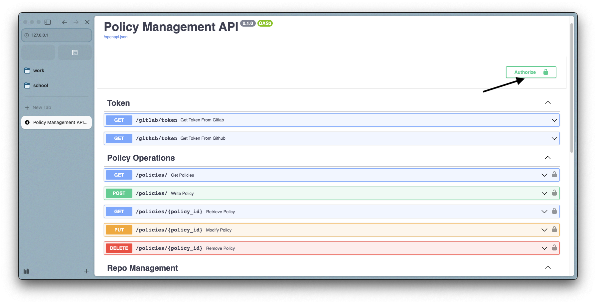

# Rest API

The application is a secured REST API, protected with an access token generated from either gitlab or github, depending on the repository you are using. Which means that you need to be authenticated to with Gitlab if you are using a Gitlab repository, and with Github if you are using a Github repository.

Using the API is pretty straightforward without a front-end, you just need to send a request to the API endpoint, with the access token in the header. The access token is generated from the Gitlab or Github account you are using to access the repository.

If you prefer to access the API using the swagger interface, you need to paste the access token in the top right corner of the swagger interface(see image below).



## Authentication

GET `/gitlab/token` - Get a Gitlab access token
GET `/github/token` - Get a Github access token

These endpoints are only needed if your application has a front-end. They will redirect you to the Gitlab or Github authentication page, and then redirect you back to the application with a valid access token.

## Policy CRUD Operations

POST `/policies/`  Create new policy

The POST route takes a request body containing the rules defined according to the schema. It is then, used to build a new policy. The response will be a REGO file written and pushed to GitHub as a newly established remote repository, with the request body conforming to a specified syntax described by the pydantic model `Policy`. <br />

An example request body is: <br />

```json
{
"name": "Example",
"rules": [
   [
      {
      "command": "input_prop_equals",
      "properties": {
         "input_property": "request_path",
         "value": [
            "v1",
            "collections",
            "*"
         ],
         "exceptional_value": "obs"
      }
      },
      {
         "command": "input_prop_in",
         "properties": {
            "input_property": "company",
            "datasource_name": "items",
            "datasource_loop_variable": "name"
         }
      },
      {
         "command": "input_prop_equals",
         "properties": {
            "input_property": "request_method",
            "value": "GET"
         }
      }
   ],
   [
         {
         "command": "allow_full_access",
         "properties": {
            "input_property": "groupname",
            "value": "EDITOR_ATAC"
         }
      }
   ]
]}

```

```bash
curl -X POST localhost:8000/policies
   -H 'Content-Type: application/json'
   -d $request_body

```

An example response body is: <br />
```json
{"status": 200, "message": "Policy created successfully"}
```

GET `/policies/{policy_name}` 

This route gets a specific policy by it's name. The response will be a policy object conforming to the pydantic model `Policy`. <br />
Example response body: <br />


```bash
curl localhost:8000/policies/{policy_name}
```
```json
{
"name": "Example",
"rules": [
   [
      {
         "command": "input_prop_equals",
         "properties": {
            "input_property": "request_path",
            "value": [
               "v1",
               "collections",
               "*"
            ],
            "exceptional_value": "obs"
      }
      },
      {
         "command": "input_prop_in",
         "properties": {
            "input_property": "company",
            "datasource_name": "items",
            "datasource_loop_variable": "name"
         }
      },
      {
         "command": "input_prop_equals",
         "properties": {
            "input_property": "request_method",
            "value": "GET"
         }
      }
   ],
   [
         {
         "command": "allow_full_access",
         "properties": {
            "input_property": "groupname",
            "value": "EDITOR_ATAC"
         }
      }
   ]
]}
```


GET `/policies/` Read all policies  

The GET route get all policies that have been created. The response will be a list of all policies that have been created by a certain user, and contains all the associating rules with the policy <br />

```bash
curl localhost:8000/policies
```

An example response body is: <br />

```json
[
   {
      "name": "Example",
      "rules": [
         [
            {
            "command": "input_prop_equals",
            "properties": {
               "input_property": "request_path",
               "value": [
                  "v1",
                  "collections",
                  "*"
               ],
               "exceptional_value": "obs"
            }
            },
            {
               "command": "input_prop_in",
               "properties": {
                  "input_property": "company",
                  "datasource_name": "items",
                  "datasource_loop_variable": "name"
               }
            },
            {
               "command": "input_prop_equals",
               "properties": {
                  "input_property": "request_method",
                  "value": "GET"
               }
            }
         ],
         [
            {
            "command": "allow_full_access",
            "properties": {
               "input_property": "groupname",
               "value": "EDITOR_ATAC"
            }
         }
      ]
   }
]
```


PUT `/policies/{policy_name}` Update existing policy by name

```bash
curl -X PUT localhost:8000/policies/{policy_name}
   -d $request_body
```

This request method is used to update a specific policy by name. The response will be a policy object conforming to the pydantic model `Policy`. <br />
Example response body: <br />
```json
{"status": 200, "message": "Updated successfully"}
```

DELETE `/policies/policy_name}` Delete existing policy by name


```bash
curl -X DELETE localhost:8000/policies/{policy_name}
```

This request method is used to delete a specific policy by name
Example response body: <br />

```json
{"status": 200, "message": "Policy deleted successfully"}  
```

## Repository Management

GET `/user/repo/github` <br />
GET `/user/repo/gitlab`

Allows the user select the repository they want to use for their policies. The response will be a list of all the repositories that the user has access to. If the access token supplied is from Gitlab, the response will be a list of all the repositories that the user has access to on Gitlab, and vice versa.


## Database Operations

GET `/data`

This endpoint retrieves the groupnames stored as part of the usergroups needed in the rego policy creation, it is used to accurately populate the dropdown menu in the frontend. The response will be a list of all the groupnames that have been stored in the database. <br />


Example response body: <br />
```json
{
  "geostore.usergroup": [
    "EDITOR_DPAU",
    "EDITOR_CPQ",
    "VIEWER",
    "everyone",
    "EDITOR_ATAC",
    "TestGeocity",
    "EDITOR_AMBIENTE",
    "GEOCITY_ADMINS",
    "EDITOR_SIZA",
    "ROLE_SYS_GWCS",
    "EDITOR_SITPAU",
    "EDITOR_DBGT",
    "ctr-AltimetriaLineeCTRN-VIEW",
    "ctr-AltimetriaLineeCTRN-EDIT",
    "EDITOR_NIC",
    "ambiente-AsparmRaccoltaFarmaci-EDIT",
    "EDITOR_URBANISTICA",
    "EDITOR_CITTA_PUBBLICA",
    "EDITOR_VINCOLI",
    "EDITOR_COMPLETO"
  ]
}
```
