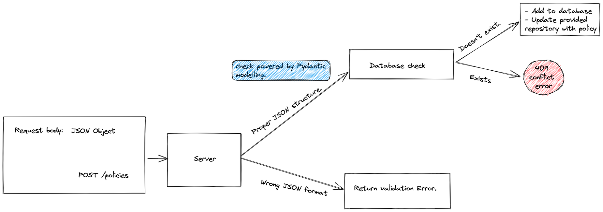
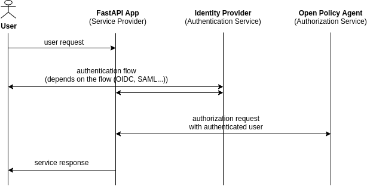

# Introduction


This project aims to abstract the technical details of writing REGO and provide a simple interface to write policies for your application in a Github/Gitlab repository. By transforming the familiar JSON format to REGO, the developer can focus on writing the policy and not on the technical details of REGO.



## Example request and response to the policy editor.

As an example, the API transforms the following JSON policy into REGO rules:

```json
{
    "example": {
        "name": "Example",
        "repo_url": "https://github.com/geobeyond/test-rego",
        "repo_id": 12345,
        "rules": [
            [
                {
                    "command": "allow_if_object_in_database",
                    "properties": {
                        "datasource_name": "usergroups",
                        "datasource_variables": ["name", "groupname"],
                    },
                },
                {
                    "command": "input_prop_in",
                    "properties": {
                        "input_property": "company",
                        "datasource_name": "items",
                        "datasource_loop_variable": "name",
                    },
                },
                {
                    "command": "input_prop_equals",
                    "properties": {
                        "input_property": "request_method",
                        "value": "GET",
                    },
                },
            ],
            [
                {
                    "command": "input_prop_equals",
                    "properties": {
                        "input_property": "company",
                        "value": "geobeyond",
                    },
                },
            ],
            [
                {
                    "command": "allow_full_access",
                    "properties": {
                        "input_property": "groupname",
                        "value": "EDITOR_ATAC",
                    },
                },
            ],
            [
                {
                    "command": "input_prop_equals",
                    "properties": {
                        "input_property": "request_path",
                        "value": "v1/collections/*",
                        "exceptional_value": "obs",
                    },
                }
            ],
            [
                {
                    "command": "input_prop_equals",
                    "properties": {
                        "input_property": "request_path",
                        "value": "v1/collections/{username}/*",
                    },
                }
            ],
            [
                {
                    "command": "input_prop_equals",
                    "properties": {
                        "input_property": "request_path",
                        "value": "v1/collections/*",
                    },
                }
            ],
            [
                {
                    "command": "input_prop_equals",
                    "properties": {
                        "input_property": "request_path",
                        "value": "v1/collections",
                    },
                },
            ],
            [
                {
                    "command": "input_prop_equals",
                    "properties": {
                        "input_property": "request_path",
                        "value": "v1/collections/{username}",
                    },
                }
            ],
            [
                {
                    "command": "input_prop_equals",
                    "properties": {
                        "input_property": "request_path",
                        "value": "v1/collections/{username}/*",
                        "exceptional_value": "obs",
                    },
                }
            ],
        ],
    }
}
```

result: 

```rego

package httpapi.authz
import input
default allow = false


allow {
  {"name": input.name,"groupname": input.groupname} = data.usergroups[_]
  input.company = data.items[_].company
  input.request_method = "GET"
}

allow {
  input.company = "geobeyond"
}

allow {
  input.groupname = "EDITOR_ATAC"
}

allow {
  input.request_path[0] = "v1" 
  input.request_path[1] = "collections" 
  input.request_path[1] != "obs"
}

allow {
  some username  
  input.request_path = ["user", username] 
  input.preferred_username = username  
  
}

allow {
  input.request_path[0] = "v1" 
  input.request_path[1] = "collections" 
  
}

allow {
  input.request_path = ["v1"]
}

allow {
  some username 
  input.preferred_username = username  
  input.request_path[0] = "v1" 
  input.request_path[1] = "collections" 
  input.request_path[2] != "obs"
}

```

## Why do we need this?

When a user sends a request to an endpoint, He/She is authenticated by an identity provider e.g Keycloak, AWS IAM, or Okta. The identity provider provides the user with an access token that contains information about the user. The access token is then sent to the application and the application verifies the token and extracts the user information. 

The application simply provides an API to write the most common policy decisions for your application, by Transforming the JSON policy to REGO. The developer can focus on writing the policy and not on the technical details of REGO.



The application then uses the user information to decide whether to allow or deny the request. Writing these decisions requires knowledge of REGO policy language, which is a purpose-built declarative policy language that supports Open Policy Agent (OPA). It is used to write authorization policy allowing OPA to make access control decisions.


## How does it work?

fastapi-opa is an extension to FastAPI that allows you to add a login flow to your application within minutes using open policy agent and your favourite identity provider.

With this extension, you can authenticate your users using your favourite identity provider and then use the user information to make authorization decisions using OPA.

To show the power of this extension, we will use the following example, where we use the rego equivalent of the following JSON policy, to authorize user access to some endpoints in an application.


JSON request:

```json
    {
        "command": "input_prop_equals",
        "properties": {
            "input_property": "request_path",
            "value": "v1/collections/{username}",
        },
    }

```

Our API response:

```rego

package httpapi.authz
import input
default allow = false


allow {
  some username  
  input.request_path = ["user", username] 
  input.preferred_username = username  
  
}

```

Consider a simple FastAPI application, that uses Keycloak identity provider and Opa to make authorization decisions. 

We'll use the example rego result above to show how to use fastapi-opa to add a login flow to your application.

The policy decision in `policy/auth.rego` authorizes the user to access the endpoint if they're logged as the username in the path.

Start by cloning the repository and installing the dependencies:
  
```bash
  git clone https://github.com/r-scheele/test-api.git
```

```bash
  cd test-api
```

```bash
  poetry shell && poetry install
```

Start all the services (Keycloak and Opa) using docker-compose:

```bash
  docker-compose up -d
```

Start the application:

```bash
  uvicorn main:app --port 8000 --reload
```

The application is now running on http://localhost:8000.

### Configure postman for testing the rules

1. Import the already configured postman collection and environment variables to test the application:
`test-api.postman_collection.json` and `test-api.postman_environment.json`

2. In the login request, open the test tab and paste the following code:

```js

var response = JSON.parse(responseBody);
postman.setEnvironmentVariable("refresh_token", response.refresh_token);
postman.setEnvironmentVariable("access_token", response.access_token);
postman.setEnvironmentVariable("session_state", response.session_state);

```

### Send request to keycloak to get access token

POST `{{keycloak_server}}/auth/realms/{{realm}}/protocol/openid-connect/token`

if you're using the `test-api.postman_environment.json`, keycloak_server and realm is already set.

returns - access token 


### Send request to the application test endpoints in the REGO rules.

GET `/user/habeeb` - Accessible

response;

```json
{
    "message": "Hello World from test1"
}
```


GET `/user/john` - Inaccessible

response;

```json 
{
    "message": "Unauthorized"
}
```


GET `/user/{username}/test` - Inaccessible 

response;

```json 
{
    "message": "Unauthorized"
}
```

